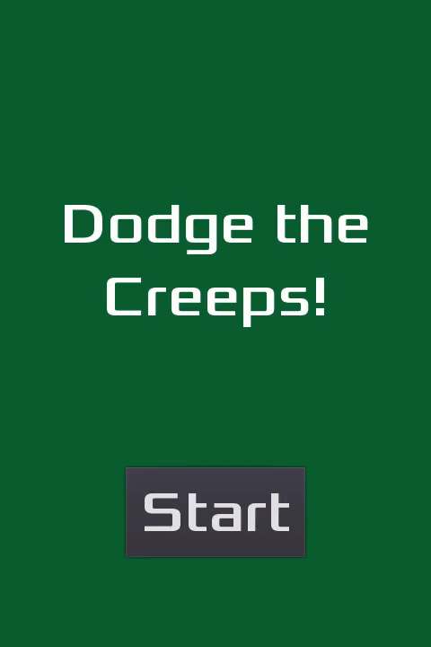

# Dodge the Creeps! (Rust-version)

## Description

In Dodge the Creeps, the player must move the character to avoid the enemies for as long as possible. Made from the [Your First Game](http://docs.godotengine.org/en/3.0/getting_started/step_by_step/your_first_game.html) tutorial. Original GDScriot code: https://github.com/kidscancode/Godot3_dodge. Original Rust code: https://github.com/godot-rust/godot-rust/tree/master/examples/dodge_the_creeps. I did not follow any a whole tutorial because the version 0.9 has released yesterday, so there is none available in this version yet. But I read a little of this [tutorial](https://paytonrules.com/post/games-in-rust-with-godot-part-one/) and also used the original Rust code.

## Preview

  

## License

This project is licensed under the MIT License - see the [LICENSE](LICENSE) file for details.
